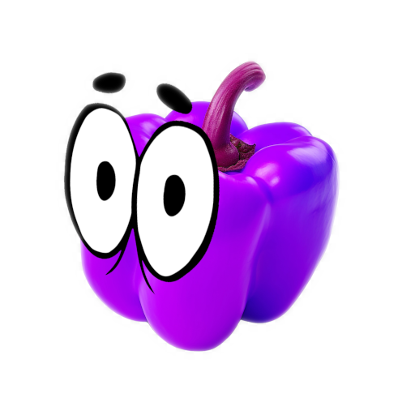

# Yellpepper - A DougDoug inspired Discord Bot



Yellpepper is a Discord bot inspired by the Babagaboosh app created by DougDoug.

Inspired by this concept, Yellpepper aims to bring similar interactive and entertaining features of AI to Discord communities, enabling users to engage in conversations, ask questions, and receive amusing responses based on predefined character profiles and AI interactions.

For more information about DougDoug and Babagaboosh, visit [DougDoug's GitHub repository](https://github.com/DougDougGithub/Babagaboosh).

## Prerequisites
Before setting up Yellpepper, ensure you have the following:

1. Discord Bot Token: Create a Discord bot on the [Discord Developer Portal](https://discord.com/developers/applications/).

2. Environment Variables: Set up the following environment variables:

- DISCORD_BOT_TOKEN: Your Discord bot token obtained from the Discord Developer Portal.
- ELEVEN_LABS_API_KEY: API key for Eleven Labs.
- OPENAI_API_KEY: API key for OpenAI.

## Configuration

### Config File (config.yaml):

Update `OPUS_LOCATION` with your installment of the opus library.

Example for Mac:
```yaml
OPUS_LOCATION: /opt/homebrew/opt/opus/lib/libopus.0.dylib
```

### Character Profiles (character_profiles.yaml):
Add your desired characters in the following format:
  ```yaml
  profiles:
    ProfileName:
      elevenlabs_voice: <elevenlabs_voice_id>
      first_system_message: <system_prompt>
  ```

- elevenlabs_voice: ID of the voice used by Eleven Labs.
- first_system_message: Initial system message for the profile.


## Firing up the Bot

1. Clone the repository:

```bash
git clone <repository-url>
cd <repository-name>
```

2. Install dependencies:

```bash
pip install -r requirements.txt
```

3. Starting the bot:

```bash
python3 bot.py
```

## License
This project is licensed under the [MIT License](LICENSE).

## Attribution
Images for the logo from [Freepik](www.freepik.com)
- [Bell-pepper](https://www.freepik.com/free-psd/sweet-pepper-fruit-isolated-transparent-background_88372150.htm#fromView=image_search_similar&page=1&position=49&uuid=13244870-f2f1-4d3f-9e99-e921099c3439)
- [Googly Eyes](https://www.freepik.com/free-vector/pack-decorative-cartoon-eyes_1061887.htm#fromView=search&page=1&position=24&uuid=4dc6a68e-690e-4023-a2c3-492351276328)